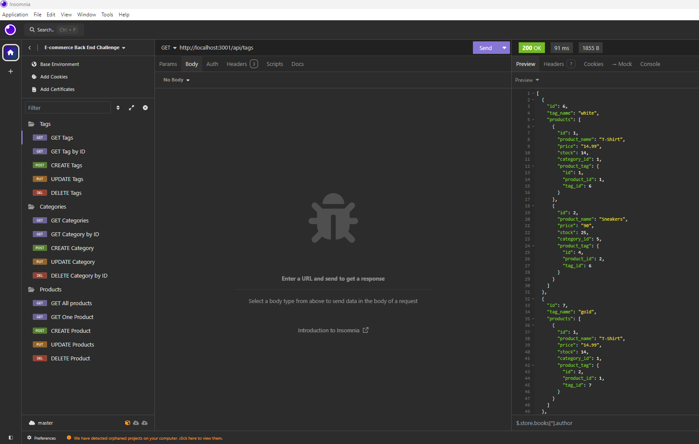
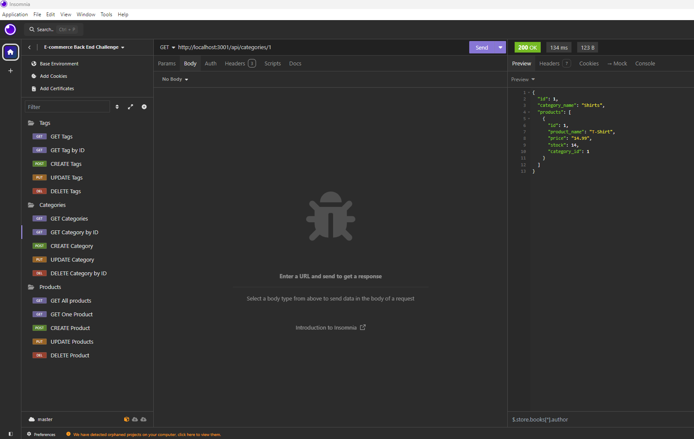
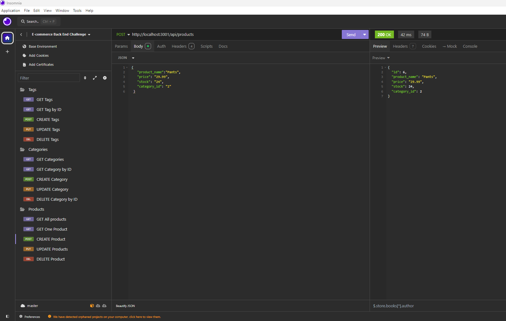

# E-Commerce Back End

## Description

This project is a back-end application for an e-commerce platform. It uses Express.js for the server, PostgreSQL as the database, and Sequelize ORM for database management. The application provides CRUD operations for categories, products, tags, and product tags, enabling users to manage an online store's inventory effectively.

## Table of Contents

- [Description](#Description)
- [Installation](#installation)
- [Usage](#usage)
- [API Endpoints](#api-endpoints)
- [Models](#models)
- [Contributing](#contributing)
- [Screenshots](#screenshots)
- [Deployment](#deployment)
- [License](#license)

## Installation

1. Clone the repository:
2. Navigate to the project directory: cd ecommerce-backend
3. Install the necessary dependencies: npm install
4. Set up your PostgreSQL database and configure the database connection in the .env file:
5. Run the database migrations and seed the database: node seeds/index.js
6. Start the server: npm start

- The server will start on http://localhost:3001.

## Usage

- This application is used to manage an e-commerce store's inventory through a set of API endpoints. It allows for creating, reading, updating, and deleting categories, products, and tags.
- To test the API routes, you can use Insomnia or a similar tool.

## API Endpoints

1. Categories

- GET /api/categories - Get all categories
- GET /api/categories/:id - Get a single category by ID
- POST /api/categories - Create a new category
- PUT /api/categories/:id - Update a category by ID
- DELETE /api/categories/:id - Delete a category by ID

2. Products

- GET /api/products - Get all products
- GET /api/products/:id - Get a single product by ID
- POST /api/products - Create a new product
- PUT /api/products/:id - Update a product by ID
- DELETE /api/products/:id - Delete a product by ID

3. Tags

- GET /api/tags - Get all tags
- GET /api/tags/:id - Get a single tag by ID
- POST /api/tags - Create a new tag
- PUT /api/tags/:id - Update a tag by ID
- DELETE /api/tags/:id - Delete a tag by ID

## Models

1. Category - Defines the product categories.
2. Product - Represents products with associations to categories and tags.
3. Tag - Tags to categorize products further.
4. ProductTag - Junction table to handle many-to-many relationships between products and tags

## Contributing

1. Fork the repository.
2. Create a new branch (`git checkout -b feature-branch`).
3. Commit your changes (`git commit -m "Add new feature"`).
4. Push to the branch (`git push origin feature-branch`).
5. Open a pull request.

## Screenshots

## Deployment

## License

This project is licensed under the [MIT LICENSE](LICENSE).

> [!NOTE]  
> Recourses used for creating code. Referred back to class work for file format such as reviewing class recording. Worked with peers on assignment and compared challenge template to assist with creating readme file.
